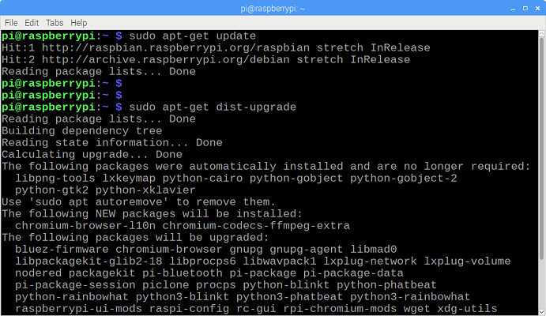
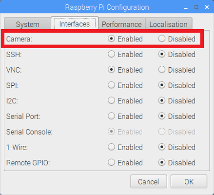
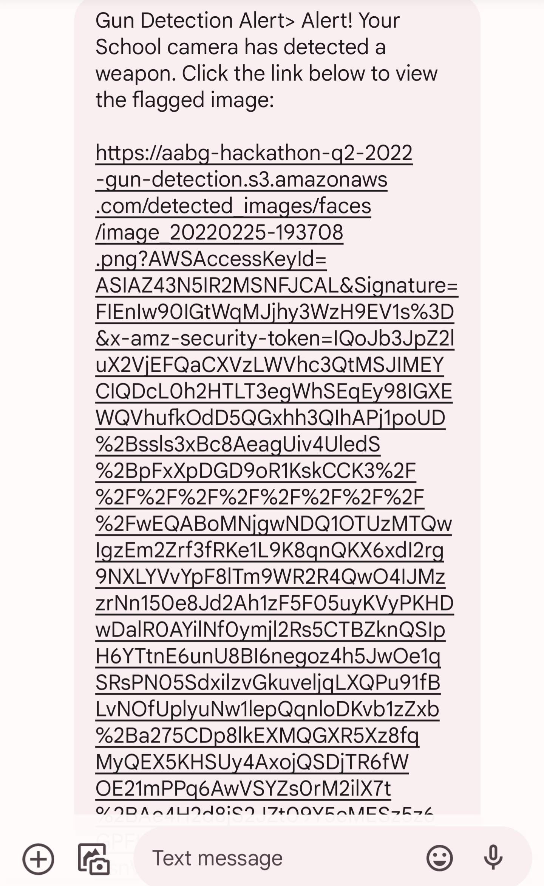

# Tutorial to set up Open CV and AWS Rekognition that can detect weapon and alert using Raspberry Pi

## Introduction
This guide provides step-by-step instructions for how to set up Open CV API on the Raspberry Pi. By following the steps in this guide, you will be able to use your Raspberry Pi to perform object detection on live video feeds from a Picamera. 

Here's a YouTube video that can guide on how to setup raspberry pi initially!

[

The repository includes the gun_detect.py script, which is a Python script that loads an object detection using camera in opencv and uses it to detect objects in a Picamera video feed. The guide is written for opencv 4.4.0 on a Raspberry Pi Model 4. It will likely work for newer versions of TensorFlow.

## Steps
### 1. Update the Raspberry Pi
First, the Raspberry Pi needs to be fully updated. Open a terminal and issue:
```
sudo apt-get update
sudo apt-get dist-upgrade
```
Depending on how long it’s been since you’ve updated your Pi, the upgrade could take anywhere between a minute and an hour.

<p align="center">
  
</p>

### 2. Install OpenCV

To get OpenCV working on the Raspberry Pi, there’s quite a few dependencies that need to be installed through apt-get. If any of the following commands don’t work, issue “sudo apt-get update” and then try again. Issue:
```
sudo apt-get install libjpeg-dev libtiff5-dev libjasper-dev libpng12-dev
sudo apt-get install libavcodec-dev libavformat-dev libswscale-dev libv4l-dev
sudo apt-get install libxvidcore-dev libx264-dev
sudo apt-get install qt4-dev-tools libatlas-base-dev
```
The OpenCV software uses other third-party software libraries. These have to be installed first. Some come with the Raspbian operating system, others may have been gathered over time, but it's better to be safe than sorry, so here is the complete list. Only the latest packages are installed by the procedure.
```
$ sudo apt-get update
$ sudo apt-get upgrade
$ sudo apt-get install cmake gfortran
$ sudo apt-get install python3-dev python3-numpy
$ sudo apt-get install libjpeg-dev libtiff-dev libgif-dev
$ sudo apt-get install libavcodec-dev libavformat-dev libswscale-dev
$ sudo apt-get install libgtk2.0-dev libcanberra-gtk*
$ sudo apt-get install libxvidcore-dev libx264-dev libgtk-3-dev
$ sudo apt-get install libtbb2 libtbb-dev libdc1394-22-dev libv4l-dev
$ sudo apt-get install libopenblas-dev libatlas-base-dev libblas-dev
$ sudo apt-get install libjasper-dev liblapack-dev libhdf5-dev
$ sudo apt-get install gcc-arm* protobuf-compiler
# The latest Debian 11, Bullseye don't support python2 full
# don't try to install if you're having a Raspberry Bullseye OS
$ sudo apt-get install python-dev python-numpy
```
opencv cannot be installed using pip install in rasp pi as it is not yet compatiable with this version of rasp pi. We are going to download the zip and install it through below steps. 
```
$ cd ~
$ wget -O opencv.zip https://github.com/opencv/opencv/archive/4.4.0.zip
$ wget -O opencv_contrib.zip https://github.com/opencv/opencv_contrib/archive/4.4.0.zip

$ unzip opencv.zip
$ unzip opencv_contrib.zip
$ mv opencv-4.4.0 opencv
$ mv opencv_contrib-4.4.0 opencv_contrib
```
Before we begin with the actual build of the library, there is one small step to go. You have to make a directory where all the build files can be located.
Now it is time for an important step. Here you tell CMake what, where and how to make OpenCV on your Raspberry. There are many flags involved. The most you will recognize. We save space by excluding any (Python) examples or tests. There are only bare spaces before the -D flags, not tabs. By the way, the two last dots are no typo. It tells CMake where it can find its CMakeLists.txt (the large recipe file); one directory up.
 
```
$ cd ~/opencv/
$ mkdir build
$ cd build

$ cmake -D CMAKE_BUILD_TYPE=RELEASE \
        -D CMAKE_INSTALL_PREFIX=/usr \
        -D OPENCV_EXTRA_MODULES_PATH=~/opencv_contrib/modules \
        -D ENABLE_NEON=ON \
        -D ENABLE_VFPV3=ON \
        -D WITH_OPENMP=ON \
        -D BUILD_TIFF=ON \
        -D WITH_FFMPEG=ON \
        -D WITH_TBB=ON \
        -D BUILD_TBB=ON \
        -D BUILD_TESTS=OFF \
        -D WITH_EIGEN=OFF \
        -D WITH_GSTREAMER=OFF \
        -D WITH_V4L=ON \
        -D WITH_LIBV4L=ON \
        -D WITH_VTK=OFF \
        -D WITH_QT=OFF \
        -D OPENCV_ENABLE_NONFREE=ON \
        -D INSTALL_C_EXAMPLES=OFF \
        -D INSTALL_PYTHON_EXAMPLES=OFF \
        -D BUILD_NEW_PYTHON_SUPPORT=ON \
        -D BUILD_opencv_python3=TRUE \
        -D OPENCV_GENERATE_PKGCONFIG=ON \
        -D BUILD_EXAMPLES=OFF ..
```
If everything went well, CMake generates a report that looks something like this (for readability purposes we omitted most lines). Very crucial are the Python sections. If not, do "which python" to find where the lib is present . Navigate to swapfile and change CONF_SWAPSIZE to 2048 and do restart for swapfile
```
$ sudo nano /etc/dphys-swapfile
$ sudo /etc/init.d/dphys-swapfile stop
$ sudo /etc/init.d/dphys-swapfile start
```
Now everything is ready for the great build. This takes a lot of time. Be very patient is the only advice here. Don't be surprised if at 99% your build seems to be crashed. That is 'normal' behaviour. Even when your CPU Usage Monitor gives very low ratings like 7%. In reality, your CPU is working so hard it has not enough time to update these usage numbers correctly.

```
$ make -j4

```
OpenCV will not install proper Python libraries. If everything goes well, it will copy ".cso" file in to /usr/lib/python3.7/dist-packages. If not, do "which python" to find where the lib is present . To complete installation do below steps
```
$ sudo make install
$ sudo ldconfig
# cleaning (frees 300 KB)
$ make clean
$ sudo apt-get update
```
There is one thing left to do before the installation of OpenCV 4.4 on your Raspberry Pi 4 is completed. That is resetting the swap space back to its original 100 Mbyte. Flash memory can only write a limited number of cycles.
```
$ sudo nano /etc/dphys-swapfile

set CONF_SWAPSIZE=100 with the Nano text editor

$ cd ~
$ rm opencv.zip
$ rm opencv_contrib.zip
$ sudo reboot
```
Finally check if opencv is installed by typing python3 and do "import opencv2". If it doesn't work then copy the ".so" file in to corresponding path for dist-packages  
```
# Python 3
$ cd ~/opencv/build/lib/python3
$ sudo cp cv2.cpython-37m-arm-linux-gnueabihf.so \
 /usr/lib/python3.7/dist-packages/
```

Alright, now OpenCV is installed!

### 3. Set up AWS User for rekognition!
SSH into your Raspberry Pi. Install latest version of Boto 3 (AWS SDK for Python) and AWS CLI.
```
pip install boto3
sudo pip install awscli
```
Setup authentication credentials for boto3 with AWS key ID and Secret access key setup, which we configured earlier.

```
aws configure
AWS Access Key ID [None]:  YOUR_ACCESS_KEY_ID
AWS Secret Access Key [None]: YOUR_SECRET_ACCESS_KEY
Default region name [None]: us-east-1
Default output format [None]: ENTER

```

### 4. Detect Objects!
Okay, now everything is set up for performing object detection on the Pi! The Python script in this repository, detect_gun.py, detects objects in live feeds from a Picamera or USB webcam. Basically, the script sets paths to the model and initializes the Picamera, and then begins performing object detection on each video frame from the Picamera by making calls to aws rekognition. 

If you’re using a Picamera, make sure it is enabled in the Raspberry Pi configuration menu.

<p align="center">
  
</p>

Run the script by issuing and you can see below output: 
```
python3 detect_weapon.py 
```
<p align="center">
  
</p>

If a Weapon is detected, it will send a message to the subscription number for the SNS topic 

<p align="center">
  
</p>
